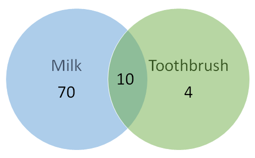

# 
 Association Rules Mining 

___

Association Rules is one of the very important concepts of machine learning being used in market basket analysis. 
But it is not the only use case.

For example: In a store, all vegetables are placed in the same aisle, all dairy items are placed together and cosmetics form another set of such groups. Investing time and resources on deliberate product placements like this not only reduces a customer’s shopping time, but also reminds the customer of what relevant items (s)he might be interested in buying, thus helping stores cross-sell in the process. Association rules help uncover all such relationships between items from huge databases. 

Association Rules is an unsupervised technique to unravel any pattern or relation between items. The rule defines association between A and B as A => B i.e if A is purchased B is also purchased. 

An association rule consists of an antecedent and a consequent.

$${\{Pen, Pencil\}} \to \{Paper\}$$
$$     {antecedent} \to consequent$$

For a given rule, `itemset` is the list of all the items in the antecedent and the consequent.

$${itemset} \to \{Pen, Pencil, Paper\}$$

The goodness of an association rule is measured based on three primary factors

**Support**

This measure gives an idea of how frequent an itemset is in all the transactions. 

- Consider itemset1 = {bread} and itemset2 = {shampoo}. There will be far more transactions containing bread than those containing shampoo. So as you rightly guessed, itemset1 will generally have a higher support than itemset2. 

- Now consider itemset1 = {bread, butter} and itemset2 = {bread, shampoo}. Many transactions will have both bread and butter on the cart but bread and shampoo? Not so much. So in this case, itemset1 will generally have a higher support than itemset2. Mathematically, support is the fraction of the total number of transactions in which the itemset occurs.

$$
{Support(\{A\} \to \{B\}) = \frac{Transactions\ containing\ both\ A\ and\ B"}{Total\ number\ of\ transactions}}
$$

Value of `support` helps us identify the rules worth considering for further analysis. 

For example, one might want to consider only the itemsets which occur at least 50 times out of a total of 10,000 transactions i.e. support = 0.005. 

If an itemset happens to have a very low support, we do not have enough information on the relationship between its items and hence no conclusions can be drawn from such a rule.

**Confidence**

This measure defines the likeliness of occurrence of consequent on the cart given that the cart already has the antecedents. 

For example, to answer the question — of all the transactions containing say, {Captain Crunch}, how many also had {Milk} on them? 

We can say by common knowledge that {Captain Crunch} → {Milk} should be a high confidence rule. Technically, confidence is the conditional probability of occurrence of consequent given the antecedent.

$$
{Confidence(\{A\} \to \{B\}) = \frac{Transactions\ containing\ both\ A\ and\ B"}{Transactions\ containing\ A}}
$$

Consider few more examples before moving ahead. 

- What do you think would be the confidence for {Butter} → {Bread}? 
   That is, what fraction of transactions having butter also had bread? Very high i.e. a value close to 1? That’s right. 
   
- What about {Yogurt} → {Milk}? High again. {Toothbrush} → {Milk}? Not so sure? Confidence for this rule will also be high since {Milk} is such a frequent itemset and would be present in every other transaction.

*It does not matter what you have in the antecedent for such a frequent consequent. The confidence for an association rule having a very frequent consequent will always be high.*

<i>
Total transactions = 100.
</i>
<i>
10 of them have both milk and toothbrush, 70 have milk but no toothbrush and 4 have toothbrush but no milk.
</i>

Consider the numbers from the above figure. `Confidence` for ${\{Toothbrush}\} \to {\{Milk\}}$
will be 10/(10+4) = 0.7. Looks like a high confidence value. But we know intuitively that these two products have a weak association and there is something misleading about this high confidence value. Lift is introduced to overcome this challenge.

If confidence is very high, it implies that when A is purchased then the probability of purchasing B is very high i.e. the rule is strong.

**`Considering just the value of confidence limits our capability to make any business inference.`**

**Lift**

Lift controls for the support (frequency) of consequent while calculating the conditional probability of occurrence of {B} given {A}. 

Lift is a very literal term given to this measure. Think of it as the **`lift`** that {A} provides to our confidence for having {B} on the cart. To rephrase, lift is the rise in probability of having {B} on the cart with the knowledge of {A} being present over the probability of having {B} on the cart without any knowledge about presence of {A}. Mathematically,

$$
{Lift(\{A\} \to \{B\}) = ( \frac{Transactions\ containing\ both\ A\ and\ B}{Transactions\ containing\ A}} )/{(Fractions\ of\ transactions\ containing\ B )}
$$

In cases where {A} actually leads to {B} on the cart, value of lift will be greater than 1. 

Let us understand this with an example which will be continuation of the {Toothbrush} → {Milk} rule.

Probability of having milk on the cart with the knowledge that toothbrush is present (i.e. confidence) : 10/(10+4) = 0.7

Now to put this number in perspective, consider the probability of having milk on the cart without any knowledge about toothbrush: 80/100 = 0.8

These numbers show that having toothbrush on the cart actually reduces the probability of having milk on the cart to 0.7 from 0.8! This will be a lift of 0.7/0.8 = 0.87. Now that’s more like the real picture. A value of lift less than 1 shows that having toothbrush on the cart does not increase the chances of occurrence of milk on the cart in spite of the rule showing a high confidence value. A value of lift greater than 1 vouches for high association between {B} and {A}. More the value of lift, greater are the chances of preference to buy {B} if the customer has already bought {A}. Lift is the measure that will help store managers to decide product placements on aisle.

If lift is very high, it implies that when B is purchased then the confidence for the rule is very high or most of the times B was purchased along with A i.e. the rule is very strong.

***`Ideally, we look for rules that have low support, high confidence and high lift.`***

**Association Rules Mining**

Now that we understand how to quantify the importance of association of products within an itemset, the next step is to generate rules from the entire list of items and identify the most important ones. This is not as simple as it might sound. Supermarkets will have thousands of different products in store. For d items there are ${2}^{d}$ 
itemsets!! And this number increases exponentially with the increase in number of items. Finding lift values for each of these will get computationally very very expensive. How to deal with this problem? How to come up with a set of most important association rules to be considered? **`Apriori`** algorithm comes to our rescue for this.

We will see apriori algorithm as part of our activity.

___
